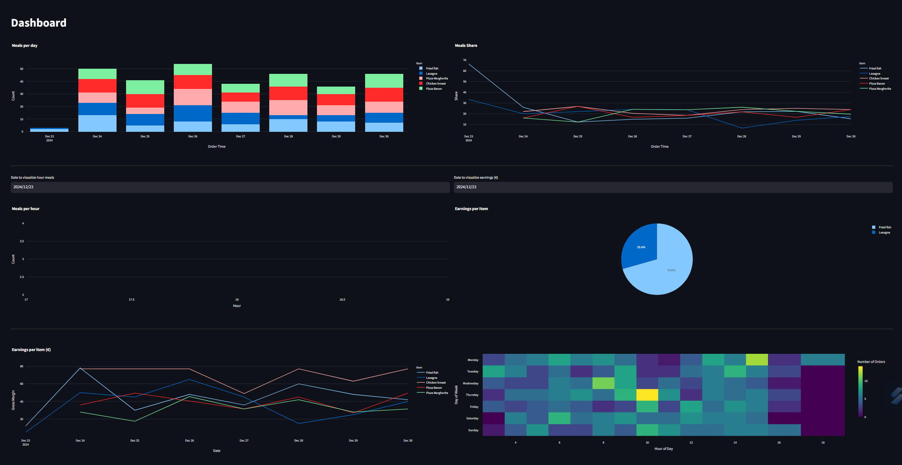

# Project Title

RMS - Restaurant Management System

## Project Description

This project is about a relatively straightforward ERP for restaurant. It's purpose is to raise awareness in this sector on the potential benefits of technology and analytics to it.
This project uses streamlit for the front-end and sqlite for information storage (Production environment would require something larger)
Most of the project components were designed as classes to allow better usability and flexibility to adapt/implement new features

## Features

- Distinct user usage;
- Menu editing and activating/deactivating options;

- Order placement
- Order management menu

- Pending orders menu

- Built-in Dashboards for profit and volumes analysis;

### Prerequisites
  - Streamlit
  - SQLITE

### Steps to Install
1. Clone the repository
2. streamlit run Login.py

Enjoy :) Feel free to suggest new features.

